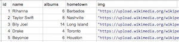

[](https://generalassemb.ly/education/web-development-immersive)

# Rails Active Record Intro

## Objectives

_After this lesson, students will be able to:_

- Describe Active Record and ORMs
- Describe database tables and migrations
- Explain primary and foreign keys
- Understand how to query a database using Active Record
- Perform CRUD actions on one model using `rails console`

## Preparation
*Before this lesson, students should already be able to:*

- Understand Rails routing
- Describe the Rails framework

## Finished App - WDIR MUSE
Over the next few lessons we're gonna build an app that tracks Artists and Songs. Here's a deployed version of [WDIR Muse](https://wdir-muse.herokuapp.com/)

<br>

## Concepts + Definitions

### Turn and Talk (15 min)
In groups, do a Google search the following topics:

- Relational Databases
- SQL (Structured Query Language)
- MySQL
- ORM (Object Relational Mapper)
- Active Record

I'll ask each group to explain one in their own words to the class.

### Relational Databases (RDBMS)
RDBMS stand for __relational database management system (RDBMS)__. You can think of a relational database as a fancy Excel spreadsheet. Here's what our **Artist** Model will look like:




- In this example, each **Model** in our app would have it's own tab in the spreadsheet called a **Table**.
- Each **Row** in the spreadsheet is an **instance** of the Model and is assigned an `_id`.
- The `_id` is called a **Primary Key**. No record may have the same `_id`. We'll talk more about Primary and Foreign Keys in our MySQL lesson. 
- Each **column** is a **Field** for that Model.

**NOTE** - Database tables are **plural** (e.g.- "artists") because they contain multiple records/instances of the **singular** `Model`.


<br>

### SQL (Structured Query Language)
Relational Databases are also commonly referred to as **SQL** databases. [**SQL**](https://en.wikipedia.org/wiki/SQL), or Structured Query Language is a special-purpose programming language designed for managing data held in a relational database management system (RDBMS)

**QUESTION** - Can you name some other Relational or SQL Databases? 

Writing SQL queries can be pretty confusing, but luckily, we have a tool that will manage the SQL database queries for us. We'll actually be able to observe the SQL queries that Active Record builds for us in our Rails server console.

<br>

### ORM (Object Relational Mapper)
- *Official* [wikipedia definition](https://en.wikipedia.org/wiki/Object-relational_mapping). A programming technique for converting data between incompatible type systems in object-oriented programming languages.

> Thats sounds like a lot of 5 dollar words, but what does it really mean?

We need a way to encapsulate our databases into objects that we can talk to on our server. ORM's serve that purpose. Remember those tables we created in SQL? Well, its an object represented on our server now. That's what ORM's do.

More concretely ORM's:

- 'Map' (translate) objects to rows in our DB (and vice versa)
- **Conventions**:
  - 1 table per Model/Class/Entity
  - table name is model name pluralized
  - each column is an attribute for that model
- Table associations are handled using foreign keys

It just so happens you will be learning one of the best ORM's on the market (Active Record). It has some of the best documentation and best syntax(because ruby is awesome) the industry has to offer.

<br>

### What is Active Record?
**CFU** -  What does MVC stand for?

**Active Record** is the **M** in **MVC** - the Model - which is the layer of the system responsible for representing business data and logic. In Rails, a Model is a fancy word for a Class. 

Active Record will be a "translator" between what data the user requests and our database. It'll generate the complex SQL queries for us.

To use a restaurant metaphor (a figure of speech in which a word or phrase is applied to an object or action to which it is not literally applicable.):

- The user is the customer
- Active Record is the waiter that takes our request to the kitchen
- The kitchen is the database. It contains the ingredients (data) for the order we've requested

<br>

### Migrations and Schema

Rails and MySQL are separate entities that live in different locations on your computer.

Our `schema.rb` file represents the current state of our database. It's a way to see what our database looks like under the hood (tables, fields, datatypes).

Anytime we want to change or update something in our database we need to run a **migration** which will update our **schema.rb** file and our database. For example, we'd do this when:

- We add a new Model to our app
- We want to add, rename, or delete a field.
- If we want to change a datatype.

<br>


## Installing MySQL gem
gem install mysql2

## Generate the Muse Rails App
1. `cd` into the directory that you want to create your app
1. Run this in your Terminal `rails new muse -d mysql` to generate a new Rails app called Muse
	- `-d mysql` tells Rails that we want to use a MySQL database instead of SQLite3 (the default). This adds gem of mysql to our `Gemfile`
2. Be sure to `cd` into the `muse` project folder and open the project in your IDE of choice
4. Run `rails db:create db:migrate` to initialize our database and create a `db/schema.rb` file
5. Open a new Terminal tab and start the Rails server with `rails s`. You'll want to keep the server running in a seperate window to make your workflow easier.
6. In your browser, navigate to `http://localhost:3000`. You should see the Rails welcome page


<br>


## Create our `Artist` Model

Let's kick the tires with Rails, MySQL and Active Record. We'll start building the data layer of our Muse app by creating an `Artist` model.

1. Make sure to `cd` into your Muse App directory. 

2. `rails g model Artist name hometown img albums:integer`
	- This command will create a **migration file** that will let the database know about our new Model
3. Run `rails db:migrate`
	- This command will write the **migration** file information to our `schema.rb`. It'll tell our MySQL database to create an `artists` table with the appropriate fields.


### Seed our database with artists

Let's seed our database with some Artists so we have some data to work with.

1. Copy and paste this data into your `db/seeds.rb` file:

	```ruby
	Artist.create(name: "Rihanna", albums: 6, hometown: "Barbados", img: "http://mccarthyamp.com/wp-content/uploads/2016/02/23445669273_bfc7c4062b_b.jpg")
	Artist.create(name: "Taylor Swift", albums: 8, hometown: "Nashville", img: "https://upload.wikimedia.org/wikipedia/en/f/f6/Taylor_Swift_-_1989.png")
	Artist.create(name: "Billy Joel", albums: 14, hometown: "Long Island", img: "https://images-na.ssl-images-amazon.com/images/I/81RgoBLQOKL._SY355_.jpg")
	Artist.create(name: "Drake", albums: 4, hometown: "Toronto", img: "http://images.complex.com/complex/image/upload/t_in_content_image/drake-thank-me-later-album-cover_o6ek33.jpg")
	Artist.create(name: "Beyonce", albums: 6, hometown: "Houston", img: "http://www.fuse.tv/image/571c26a6017704456e00001b/816/545/beyonce-lemonade-album-cover-full.jpg")
	```

2. Run `rails db:seed` from the command line to populate your database

3. Open a new Terminal tab and enter `rails c` to confirm that we have some data to work with.
4. In `rails c`, type in `Artist.count` and confirm that you have 5 Artists.


<br>


CRUD for our Artist Model
------------------------------
<details>
<summary>What does CRUD stand for?</summary>
<br>
**CRUD** is an acronym for the four verbs we use to operate on data: **C**reate,
**R**ead, **U**pdate and **D**elete. **Active Record** automatically creates methods
to allow an application to read and manipulate data stored within its tables.

</details>

Before we create the controllers and views of our app we're gonna take a look at what Active Record is doing under the hood with our models. We're gonna take a look at the exact same code we're gonna put into our Rails controllers later on.


## Create

### `.new` + `.save`
Let's create an instance of the `Artist` object on the ruby side, but that does not save originally. Note the syntax for creating a `new` instance.

```ruby
adele = Artist.new(name: "Adele", hometown: "London", albums: 3, img: "https://pbs.twimg.com/profile_images/657199367556866048/EBEIl2ol.jpg")

adele.name 	#=> "Adele"
adele.hometown 	#=> "London"
```
To save our instance to the database we use `.save`:

```ruby
adele.save

adele
# We know that the Artist has been saved because it now has id:, created_at: and updated_at: fields.
```

<br>


Create your a Artist using `.new` and `.save` and add him/her to the database.

<br>

### `.create`
**YOU DO** - The `create` method will both instantiate and save a new record into the database:

```ruby
sia = Artist.create(name: "Sia", albums: 5, hometown: "Sydney", img: "https://pbs.twimg.com/profile_images/692921625801592833/sny-shV1.png")
```

<br>


Add an Artist to your database using `.create`

<br>

## Read

Active Record provides a rich API for accessing data within a database. Below
are a few examples of different data access methods provided by Active Record.

```ruby
# return a collection of all Artists
artists = Artist.all
```

```ruby
# return the first Artist
first_artist = Artist.first
```

```ruby
# return the first user named Adele
adele = Artist.find_by_name('Adele')

# or
adele = Artist.find_by(name: 'Adele')

# or find by id
taylor = Artist.find(2)

# '.where' will return all artists named Adele who live in London
adele = Artist.where(name: 'Adele', hometown: 'London')
```

<br>


- Find the Artist with 14 albums
- Find the Artist with an `id` of 4


You can learn more about querying an Active Record model in the [Active Record
Query Interface](http://guides.rubyonrails.org/active_record_querying.html) guide.

<br>

## Update

Once an Active Record object has been retrieved, its attributes can be modified
and it can be saved to the database.

```ruby
britney = Artist.find_by_name('Adele')
britney.name = 'Britney'
britney.save
```

A shorthand for this is to use a hash mapping attribute names to the desired
value, like so:

```ruby
adele = Artist.find_by_name('Britney')
adele.update(name: 'Adele')
```
<br>


- Choose a Artist and update their `name` and `hometown` attributes

<br>


## Delete

Likewise, once retrieved an Active Record object can be destroyed which removes it from the database.

```ruby
adele = Artist.find_by_name('Adele')
adele.destroy
Artist.all 	#=> confirm she's been deleted
```
<br>


- `delete` an Artist

## Independent Practice (15 mins)

- Create 3 new Artists
- Update an Artist's attribute
- Delete an Artist you created

<br>


## Conclusion (5 mins)

In this lesson we dove into some dense topics:

- Relational Databases
- SQL (Structured Query Language)
- MySQL
- ORM (Object Relational Mapper)
- Active Record

We also created an `Artist` model for our Muse app. In the next lessons we're gonna add a second model (`Song`) and create an Active Record association with `Artist`. We'll also add views and forms to our Rails app so that we can perform CRUD operations in the  browser.


<br>


## Labtime

Let's practice what we just did! You're gonna create an app using `Author` and `Book` as the models. 

- Walk back through this lesson. Create a new Rails app called `books-app`. Instead of `Artist` you'll create an `Author` model. 
- Come up with 4 fields that you want your author table to have (e.g.- publisher, genre, birthdate, first_name, last_name, pen_name)
- You'll need to create your own seed data for your authors.

<br>

## Additional Resources

- https://guides.rubyonrails.org/routing.html
- https://guides.rubyonrails.org/action_controller_overview.html
- https://guides.rubyonrails.org/active_model_basics.html
