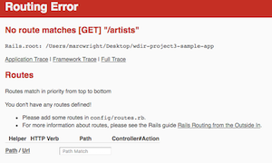
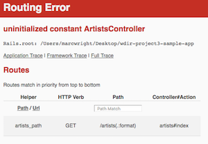
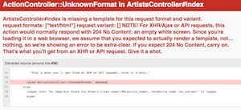

[](https://generalassemb.ly/education/web-development-immersive)

# Rails Routes, Views, Controllers, Forms

## Objectives
- Add index, show, new, create to our app
- Add form for a new artist and songs

## Prerequisites

- Be able to create a new Rails app with routes for static pages


## Intro

In the previous lessons we created `Artist` and `Song` models and relationships. Up to this point we did all of our work in `rails c`. Let's add some views so our users can interact with our site.

Up to this point in our Muse app, we've worked with the **Model** or data layer. Now we're gonna add some **Controllers** and **Views** to complete the **MVC** convention.

<br>

## Review of our Routes

Let's use the resource `Artist` to review our routes and http verbs:

- **Index (GET)** - Renders all of the artists
- **Show (GET)** - Renders one artist
- **New (GET)** - Renders a form to create a new artist
- **Create (POST)** - Saves the artist to the database then redirects. Create has no view. 
- **Edit (GET)** - Renders a form with an exisiting artist's data
- **Update (PATCH)** - Updates the artist we just edited. Update has no view.
- **Delete (DELETE)** - Deletes an artist

<br>

## Resource Routes

Rails gives us a nice shortcut to create all the REST-ful routes for a given resource. Open the `config/routes.rb` file and add this:

```ruby
Rails.application.routes.draw do
  root 'artists#index'
  resources :artists
end
```
You can view all the routes that Rails built by running `rails routes` in your Terminal:


Now that we have some routes, let's move forward with our error driven development!

<br>

## Artist Index

Let's do some error driven development and let Rails guide us through what we should build. Typically, the process goes like this

- route
- controller action/method
- view

### Index Route

QUESTION - What route should we go to to get all the artists? Fire up your `rails s` and go to `http://localhost:3000/artists`. What error do we get?

<br>



<br>

Let's add the following route to `routes.rb`:

```ruby
get "artists", to: "artists#index"
```
Who can explain this code? We're making a HTTP `GET` request to our app at "/artists" which will direct us to the `ArtistsController` and the `index` action.

Refresh your page and you should see the following error:

<br>



<br>


### ArtistsController Index Method

Let's have Rails build a controller for us. Run this from the Terminal (make sure artists is plural!):

```ruby
rails g controller artists
```


<br>

Refresh your page and you should see the following error:


<br>

Let's add an index method to our controller. Open `app/controllers/artists_controller.rb` and create an `index` method:

```ruby
class ArtistsController < ApplicationController
	def index
	end	
end
```

<br>

Refresh your page and you should see the following error:



<br>


### Index View

Remember that Rails will look for our artist views in a folder named `artists` within our `views` folder. 

- The command we ran earlier to generate our controller created a `views` folder called `artists`. 
- Inside THAT folder create the file `index.html.erb` 
- Add `<h1>All the Artists</h1>` to that file and refresh your page. You should see the `<h1>` render on the page.

<br>

### Grab the Artists from our Database

Let's add the Artists from our database to our index view. We'll start in our Index method in our controller. How did we grab all of something from our database?

```ruby
class ArtistsController < ApplicationController
  def index 
  	@artists = Artist.all  
  end
end
```


**YOU DO** Try to get the `@artist` to render on your index page. It doesn't have to be pretty. How will we do this?


Let's add some code to our `index.html.erb` to see the artists rendered in a table using a `.each` loop.

```html
<h1>All the Artists</h1>

<table class="striped bordered">
  <tr>
    <th>Artist</th>
    <th>Image</th>
    <th>Albums</th>
    <th>Hometown</th>
  </tr>

  <% @artists.each do |artist| %>
      <tr>
        <td><%= link_to artist.name, artist_path(artist) %></td>
        <td><%= image_tag(artist.img, size: "100x100", alt: "Artist Image") %></td>
        <td><%= artist.albums %></td>
        <td><%= artist.hometown %></td>
      </tr>
  <% end %>
</table>
```

You should see something like this (depending on your browser size):

<br>

[](screenshots/muse1.png)


<br>

## Artist Show

We'll use error driven development again.

In `routes.rb` add the next route:

```ruby
get "artists/:id", to: "artists#show", as: :artist
```

Let's add a `show` method to `artists_controller.rb`. We also need to grab the artists songs. How did we do this in `rails c`?

```ruby
def show
  @artist = Artist.find(params[:id])
  @songs = @artist.songs
end

# the variable declaration must be in this order. Why?
```

Create an artist show view here `views/artists/show.html.erb` and add the following:

```html
  <h1><%= @artist.name %> Songs</h1>
  <%= link_to "New Song", new_song_path(:artist_id => @artist.id), { :class => "button waves-effect waves-light btn" } %>
  <br><br>

  <div class="row">
    <% @songs.each do |song| %>

        <div class="card-panel grey lighten-2 col s4" style="margin: 10px">
          <%= image_tag(@artist.img, size: "100x100", alt: "Artist Image") %>
          <br>
          <strong><%= link_to song.title %></strong>
          <em><%= song.genre %></em>
        </div>
    <% end %>
  </div>
```

#### Test it out

If you click on an individual artist you'll get an error. Why?


Notice that we went ahead and added a link to add a new song, but we haven't created routes for songs yet. To move forward, go into `config/routes.rb` and have Rails create song resources routes. We'll finish this later:

```ruby
Rails.application.routes.draw do
  root 'artists#index'
  resources :artists, :songs
end
```


<br>

## Artist New Form
Let's add a `new` route to `routes.rb`. Be sure that this route is above your show route. Our routes should look like so:

```ruby
Rails.application.routes.draw do
  root to: "artists#index"

  get "about", to: "application#about"

  get "artists", to: "artists#index"
  get "artists/new", to: "artists#new"
  get "artists/:id", to: "artists#show", as: :artist
end
```

`app/controllers/artists_controller.rb`

```ruby
def new
  @artist = Artist.new
end
```

**YOU DO** - What is a partial?

`views/artists/_form.html.erb`

```html
<%= form_for @artist do |f| %>
  <div class="input-field col s6">
  	<%= f.label :name, 'Name'%>
  	<%= f.text_field :name%>
  </div>
  <div class="input-field col s6">
  	<%= f.label :albums, 'Albums' %>
  	<%= f.text_field :albums %>
  </div>
  <div class="input-field col s6">
  	<%= f.label :hometown, 'Hometown' %>
  	<%= f.text_field :hometown %>
  </div>
  <div class="input-field col s6">
  	<%= f.label :img, 'Image' %>
  	<%= f.text_field :img %>
  </div>
  <%= f.submit "Submit", :class => "btn waves-effect waves-light" %>
<% end %>
```


`views/artists/new.html.erb`

```html
<h1>New Artist</h1>

<%= render 'artists/form' %>
```

Goto `http://localhost:3000/artists/new` to make sure the form is rendering.

Finally, let's add a button on our index page to create a new artist.

`views/artists/index.html.erb`

```html
<h1>All the Artists</h1>
<%= link_to "Add an Artist", new_artist_path, { :class => "button waves-effect waves-light btn" } %>
<br><br>
```
<br>

## Artist Create

`routes.rb`

```ruby
post "artists", to: "artists#create"
```

`artists_controller.rb`

```ruby
def create
  Artist.create(params.require(:artist).permit(:name, :albums, :hometown, :img))
  redirect_to artists_path
end
```

No view for this action! Why?

<br>

## Artist Edit

In `routes.rb`, add  this after the other Artist routes

```ruby
get "artists/:id/edit", to: "artists#edit", as: :artist_edit
```

`app/controllers/artists_controller.rb`

```ruby
def edit
  @artist = Artist.find(params[:id])
end
```


Let's add a link to edit songs on our `views/artists/index.html.erb`. Let's add a new table header and table data rows:

```html
<h1>All the Artists</h1>
<%= link_to "Add an Artist", artists_new_path, { :class => "button waves-effect waves-light btn" } %>
<br><br>

<table class="striped bordered">
  <tr>
    <th>Artist</th>
    <th>Image</th>
    <th>Albums</th>
    <th>Hometown</th>
    <th>Edit</th>
  </tr>

  <% @artists.each do |artist| %>
      <tr>
        <td><%= link_to artist.name, artist_path(artist) %></td>
        <td><%= image_tag(artist.img, size: "100x100", alt: "Artist Image") %></td>
        <td><%= artist.albums %></td>
        <td><%= artist.hometown %></td>
        <td><a class="btn-floating btn-large red" href="<%= edit_artist_path(artist) %>" >
           <em class="large material-icons">Edit Artist</em>
          </a>
        </td>
      </tr>
  <% end %>
</table>
```


`views/artists/edit.html.erb` We're gonna use the same `_form.html.erb` partial from earlier. Hooray!

```html
<h1>Edit <%= @artist.name %></h1>

<%= render 'artists/form' %>
```

<br>


## Artist Update

`routes.rb`

```ruby
patch "artists/:id", to: "artists#update"
```

`app/controllers/artists_controller.rb`

```ruby
def update
  artist = Artist.find(params[:id])
  artist.update(params.require(:artist).permit(:name, :albums, :hometown, :img))
	
  redirect_to artist
end
```
<br>

## Artist Delete

`routes.rb`

```ruby
delete "artists/:id", to: "artists#destroy"
```

`app/controllers/artists_controller.rb`

```ruby
def destroy
  Artist.find(params[:id]).destroy

  redirect_to artists_path
end
```

`views/artists/index.html`

```html
<h1>All the Artists</h1>
<%= link_to "Add an Artist", artists_new_path, { :class => "button waves-effect waves-light btn" } %>
<br><br>

<table class="striped bordered">
  <tr>
    <th>Artist</th>
    <th>Image</th>
    <th>Albums</th>
    <th>Hometown</th>
    <th>Edit</th>
    <th>Delete</th>
  </tr>

  <% @artists.each do |artist| %>
      <tr>
        <td><%= link_to artist.name, artist_path(artist) %></td>
        <td><%= image_tag(artist.img, size: "100x100", alt: "Artist Image") %></td>
        <td><%= artist.albums %></td>
        <td><%= artist.hometown %></td>
        <td><a class="btn-floating btn-large red" href="<%= edit_artist_path(artist) %>" >
      				<i class="large material-icons">mode_edit</i>
    			</a>
    	  </td>
      <!--  <td><a class="btn-floating btn-large red" data-confirm="Are you sure you want to delete <%= artist.name %>?" data-method="delete" href="/artists/<%= artist.id %>" rel="nofollow"><i class="large material-icons">Delete Artist</i>
    	   </a>
        </td>
	      
	                 -->
<td> 
           <%= button_to "Delete", artist_path(artist.id), method: :delete,
              data: { confirm: "Are you sure?" } %>
              </td>
      </tr>
  <% end %>
</table>
```

<br>

## Song New
We're not gonna add full CRUD to our `Song` resource (we'll leave that to you). However, we are gonna give a user the ability to create a new `Song`.

Let's create our songs new route in `routes.rb`

```ruby
get "songs/new", to: "songs#new"
```

Let's have rails generate a controller and views folder for us: 

	rails g controller songs


Add a `new` action in `app/controllers/songs_controller.rb`.

```ruby
class SongsController < ApplicationController

  def new
    @artist = Artist.find(params[:artist_id])
    @song = Song.new
  end

end
```

Let's create a view with a form:

`views/songs/_form.html.erb`

```html
<%= form_for @song do |f| %>
  <%= f.hidden_field :artist_id, :value => @artist.id %>
  <div class="input-field col s6">
  	<%= f.label :title, 'Title' %>
  	<%= f.text_field :title %>
  </div>
  <div class="input-field col s6">
  	<%= f.label :genre, 'Genre' %>
  	<%= f.text_field :genre %>
  </div>
  <%= f.submit "Submit", :class => "btn waves-effect waves-light" %>
<% end %>
```

`views/songs/new.html.erb`

```html
<h1>New Song for <%= @artist.name %></h1>

<%= render 'songs/form' %>
```

Finally, let's add a link to our Artist show page to create a new song underneath our `<h1>`:

```html
<%= link_to "New Song", new_song_path(:artist_id => @artist.id), { :class => "button waves-effect waves-light btn" } %>
```

<br>

## Song Create

Let's add our create route in `routes.rb`:

`post "songs", to: "songs#create"`

Our controller method:

```ruby
def create
  puts params
  artist = Artist.find(params[:song][:artist_id])
  Song.create(params.require(:song).permit(:title, :length, :genre, :artist_id))
 		
  redirect_to artist
end
```


<br>


## Conclusion (5 mins)

Hooray! So over the past 4 lessons we've accomplished the following:

- Installed MySQL
- Created a new Rails app and added the Materialize gem
- Created Artist and Song models
- Set up a one-to-many relationship between Artist and Song
- Practiced our Active Record methods rails console with our seeded data
- Created 7 REST-ful routes for our Artist resource
- Created view partials
- Started REST-ful routes on our Song model

<br>


## Labtime

- Go back and fix our navbar links
- Finish adding full CRUD to `Song`
- Finish your `books_app`  


## Bonus Material:
[Debug Rails](https://lankydan.dev/2017/05/12/debugging-a-rails-server-in-visual-studio-code)
[Delete in Rails](https://www.viget.com/articles/delete-in-rails-without-jquery-and-ujs/)

